# VSDMemSoC
VSDMemSoC is a small SoC including a RISCV-based processor named RVMYTH and an external 4kB SRAM Instruction Memory (IMem) to separate the processor core and the IMem.

# Table of Contents
- [Introduction to the VSDMemSoC](#introduction-to-the-vsdmemsoc)
  - [Problem statement](#problem-statement)
  - [What is SoC](#what-is-soc)
  - [What is RVMYTH](#what-is-rvmyth)
  - [What is SRAM](#what-is-sram)
- [VSDMemSoC Modeling](#vsdmemsoc-modeling)
  - [RVMYTH modeling](#rvmyth-modeling)
  - [SRAM modeling](#sram-modeling)
  - [Step by step modeling walkthrough](#step-by-step-modeling-walkthrough)
- [OpenLANE](#openlane)
  - [OpenLANE installation](#openlane-installation)
- [Post-synthesis simulation](#post-synthesis-simulation)
  - [Synthesizing using Yosys](#synthesizing-using-yosys)
  - [How to synthesize the design](#how-to-synthesize-the-design)
  - [Post-synthesis simulation (GLS)](#post-synthesis-simulation-gls)
- [VSDMemSoC Physical Design](#vsdmemsoc-physical-design)
  - [OpenLANE details and flow](#openlane-details-and-flow)
  - [Other required tools](#other-required-tools)
    - [Magic](#magic)
  - [RVMYTH RTL2GDSII flow](#rvmyth-rtl2gdsii-flow)
    - [RVMYTH layout generation setting up the environment](#rvmyth-layout-generation-setting-up-the-environment)
    - [RVMYTH layout generation flow configuration](#rvmyth-layout-generation-flow-configuration)
    - [RVMYTH layout generation flow running](#rvmyth-layout-generation-flow-running)
    - [RVMYTH post-routing STA](#rvmyth-post-routing-sta)
    - [RVMYTH post-routing simulation](#rvmyth-post-routing-simulation)
    - [RVMYTH final GDSII layout](#rvmyth-final-gdsii-layout)
  - [VSDMemSoC-a mixed-signal RTL2GDSII flow](#vsdmemsoc-a-mixed-signal-rtl2gdsii-flow)
    - [Prerequisites for mixed-signal implementation](#prerequisites-for-mixed-signal-implementation)
      - [LIB file and its usage](#lib-file-and-its-usage)
      - [GDS file and its usage](#gds-file-and-its-usage)
      - [LEF file and its usage](#lef-file-and-its-usage)
- [Future works](#future-works)
- [Contributors](#contributors)
- [Acknowledgements](#acknowledgements)

# Introduction to the VSDMemSoC

VSDMemSoC is a small yet powerful RISCV-based SoC. The main purpose of designing such an SoC is to demonstrate the concept of separating the main core and memories of a processor. This would help to make the RISC-V more modular and portable. Here, the instruction memory is separated

  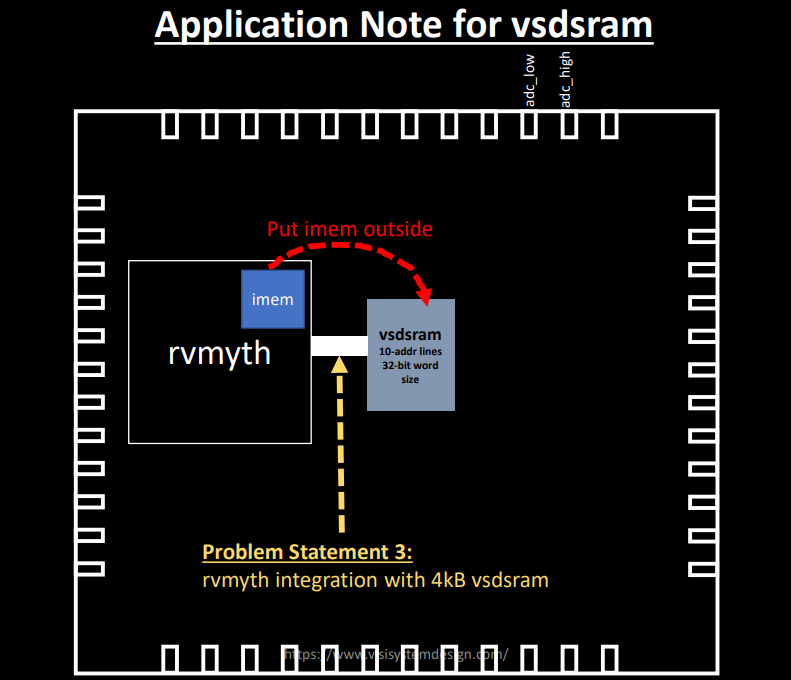

## Problem statement

This work discusses the different aspects of designing a small SoC based on RVMYTH (a RISCV-based processor). This SoC will leverage an 4kB external SRAM as the instruction memory where the program is loaded from. At the end of the day, it is possible to use this small fully open-source and well-documented SoC which has been fabricated under Sky130 technology, for educational purposes.

## What is SoC

An SoC is a single-die chip that has some different IP cores on it. These IPs could vary from microprocessors (completely digital) to 5G broadband modems (completely analog). Here we have a RISC-V core and an SRAM that makes it an IP-based mixed-signal system

## What is RVMYTH

RVMYTH core is a simple RISCV-based CPU, introduced in a workshop by RedwoodEDA and VSD. During a 5-day workshop students (including middle-schoolers) managed to create a processor from scratch. The workshop used the TLV for faster development. All of the present and future contributions to the IP will be done by students and under open-source licenses.

## What is SRAM

An SRAM is a type of random-access memory (RAM) that uses latching circuitry (flip-flop) to store each bit. It is a volatile memory where data is lost when power is removed. It is typically used for the cache and internal registers of a CPU as it very fast but expensive. The SRAM here is a 4 kB 6-transistor type with a 10-bit address bus and 32-bit data bus.

# VSDMemSoC Modeling

Here we are going to model and simulate the VSDMemSoC using makerchip.com. It is an environment that the code is written in TL-Verilog which is a simplified   Some initial input signals will be fed into `vsdmemsoc` module that make the pll start generating the proper `CLK` for the circuit. The clock signal will make the `rvmyth` to execute instructions in its `imem`. As a result the register `r17` will be filled with some values cycle by cycle. This simulation is stopped when the value equals 45 and `passed` become true. So we have 2 main elements (IP cores) and a wrapper as an SoC and there would be also a testbench module that would be used to load the program we want to run externally to the SRAM.

Please note that in the following sections we will mention some repos that we used to model the SoC. However the main source code is resided in [Source-Code Directory](src) and these modules are in [Modules Sub-Directory](src/module).

## RVMYTH modeling

As we mentioned in [What is RVMYTH](#what-is-rvmyth) section, RVMYTH is designed and created by the TL-Verilog language. So we need a way for compile and trasform it to the Verilog language and use the result in our SoC. Here the `sandpiper-saas` could help us do the job.

  [Here](https://github.com/mufuteevc/RISC-V_Core_External_SRAM_IMem) is the repo we used as a reference to model the RVMYTH. It also contains additional information on the RISC-V core and SRAM as separate modules.

## SRAM modeling

OpenRAM is an open-source Python framework to create the layout, netlists, timing and power models, placement and routing models, and other views necessary to use SRAMs in ASIC design. It supports integration in both commercial and open source flows with both predictive and fabricable technologies. We use a 32-bit word size and 10-bit address space which means there are 1024 words.

## Step by step modeling walkthrough

In this section we will walk through the whole process of modeling the VSDMemSoC in details. We will increase/decrease the digital output value and feed it to the DAC model so we can watch the changes on the SoC output. Please, note that the following commands are tested on the Ubuntu Bionic (18.04.5) platform and no other OSes.

  1. First we need to install some important packages:

  ```
  $ sudo apt install make python python3 python3-pip git iverilog gtkwave docker.io
  $ sudo chmod 666 /var/run/docker.sock
  $ cd ~
  $ pip3 install pyyaml click sandpiper-saas
  ```

  2. Now we can clone this repository in an arbitrary directory (we'll choose home directory here):

  ```
  $ cd ~
  $ git clone https://github.com/mufuteevc/VSDMemSoC.git
  ```

  3. It's time to make the pre-synthesis simulation:

  ```
  $ cd VSDMemSoC
  $ make pre_synth_sim
  ```
  

  4. We can see the waveforms by doing the following:

  ```
  1) Go to makerchip.com/sandbox
  2) Copy the *.v file generated by the previous command and paste it in the editor
  3) Compile (or Ctrl+E)
  ```

   ADD, r10, r0, r0             // Initialize r10 (a0) to 0.
   // Function:
   ADD, r14, r10, r0            // Initialize sum register a4 with 0x0
   ADDI, r12, r10, 1010         // Store count of 10 in register a2.
   ADD, r13, r10, r0            // Initialize intermediate sum register a3 with 0
   // Loop:
   ADD, r14, r13, r14           // Incremental addition
   ADDI, r13, r13, 1            // Increment intermediate register by 1
   BLT, r13, r12, 1111111111000 // If a3 is less than a2, branch to label named <loop>
   ADD, r10, r14, r0            // Store final result to register a0 so that it can be read by main program
   
   SW, r0, r10, 100
   LW, r17, r0, 100
   
  The little program we are running is shown above which sums 1 to 9: 45. There are three outputs: Diagram, Visualization 'VIZ' and Waveform. The most important signal here is the value in the R17 register as this is where we store the final value of the sum program we are running and check to see if it equals the value we want. Here is the final result of the modeling process:
  
  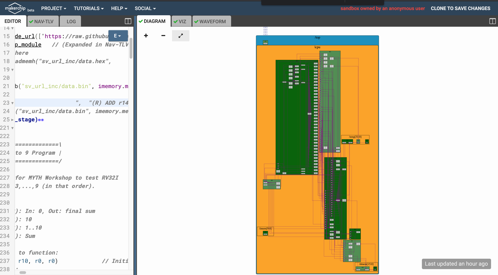
  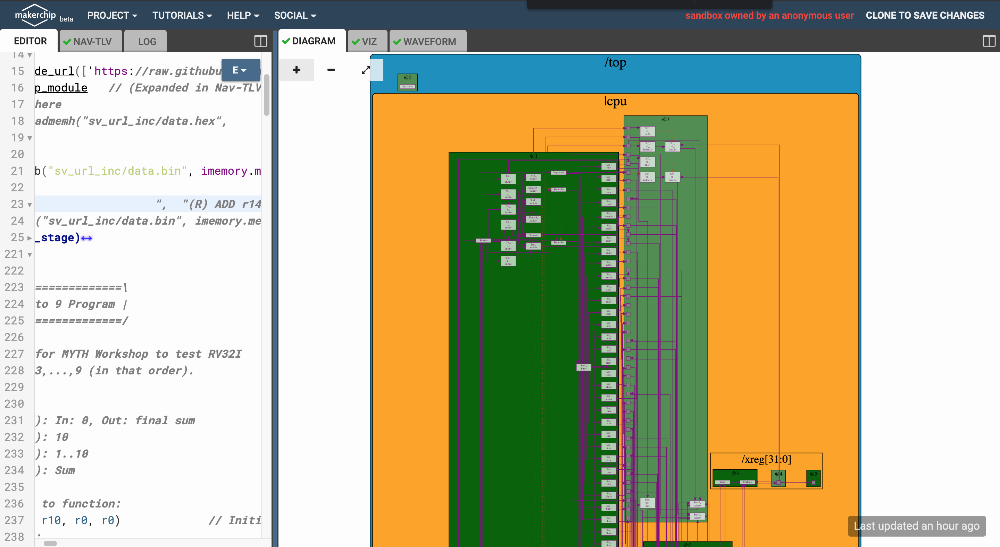
  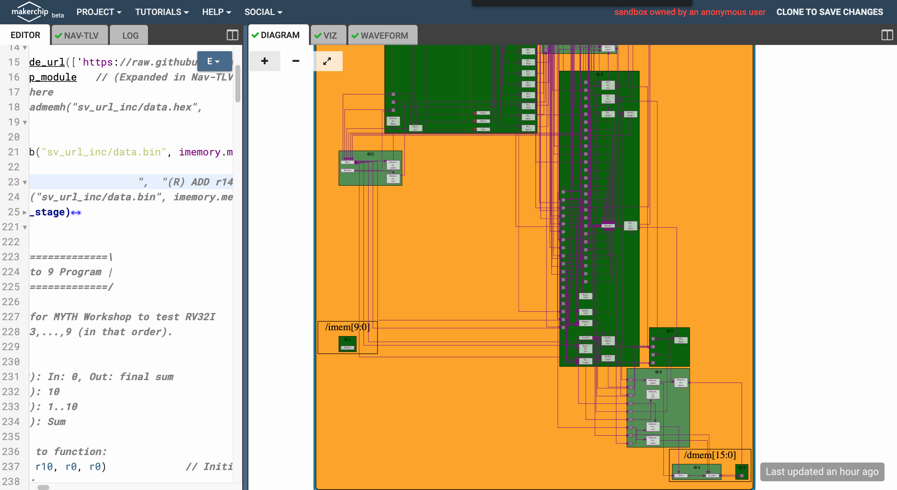

The diagrams are described first. Diagram 1 is the full system. It is a 5-stage pipelined RISCV system. The largest block at the top-left is the CPU-core that contains the ALU operations @1. To its immediate right is the logic to separate the instructions into src, dest, targets, etc @2. The smaller bock to its right is registers which are used in stages 3 and 5. @3 is also where the results are computed at the next block. You write into DMEM in @4 and load from it @5.
Diagram 2 is just a bigger version of the CPU so it is more visible while diagram 3 clearly shows the IMEM and how it has been separated from the rest of the core.
  
  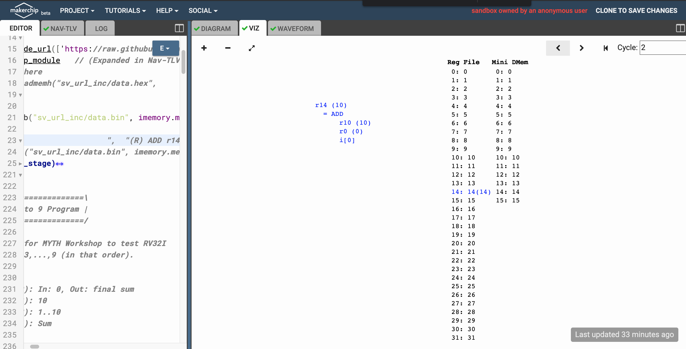
  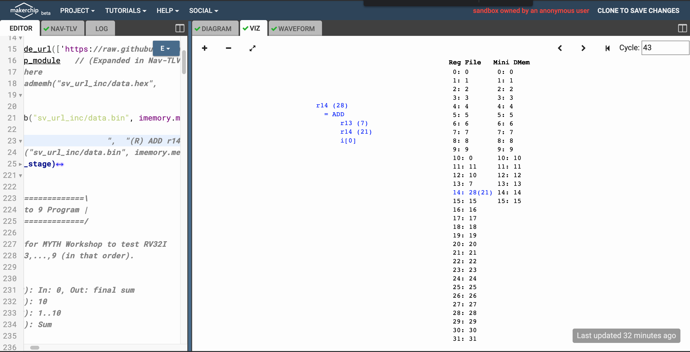
  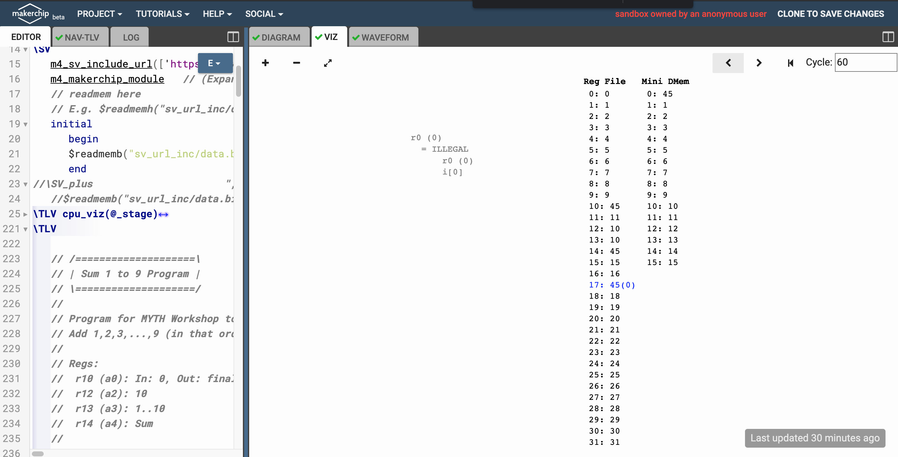

Next are the visualizations of the contents of the 32-bit registers. They are shown in cycle 2, 43 and 60 respectively. It is seen that at the final cycles, r10 and r14 contain 45 (1+2+3...9) and the simulation halts.
  
  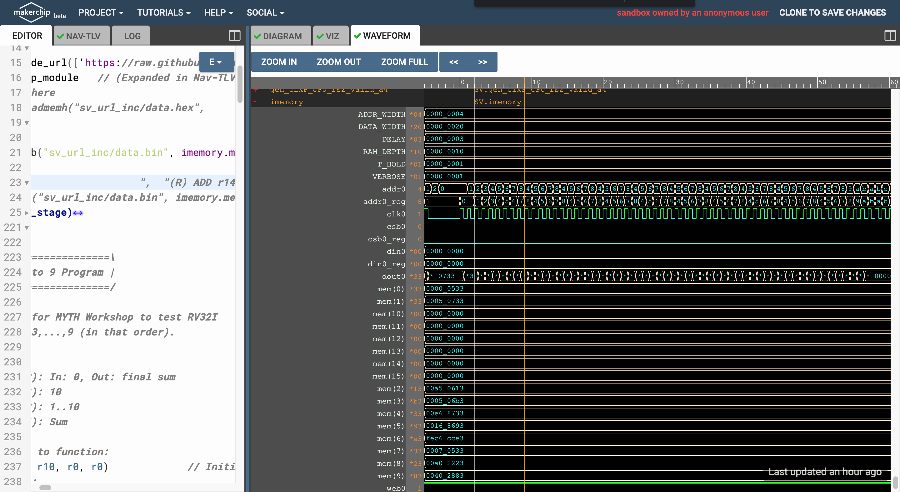
  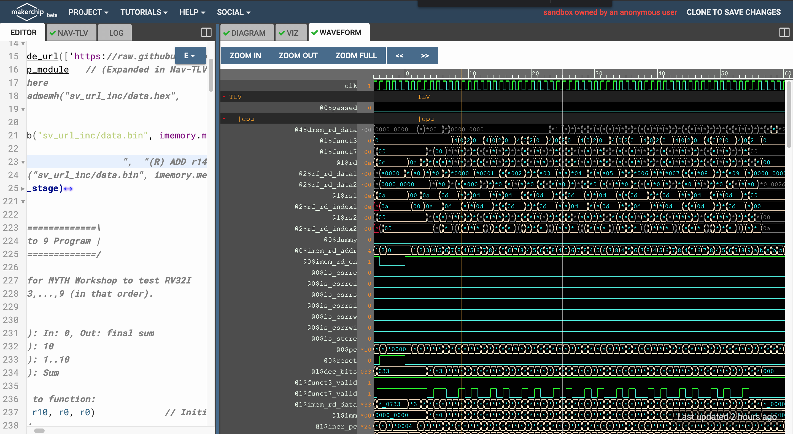
  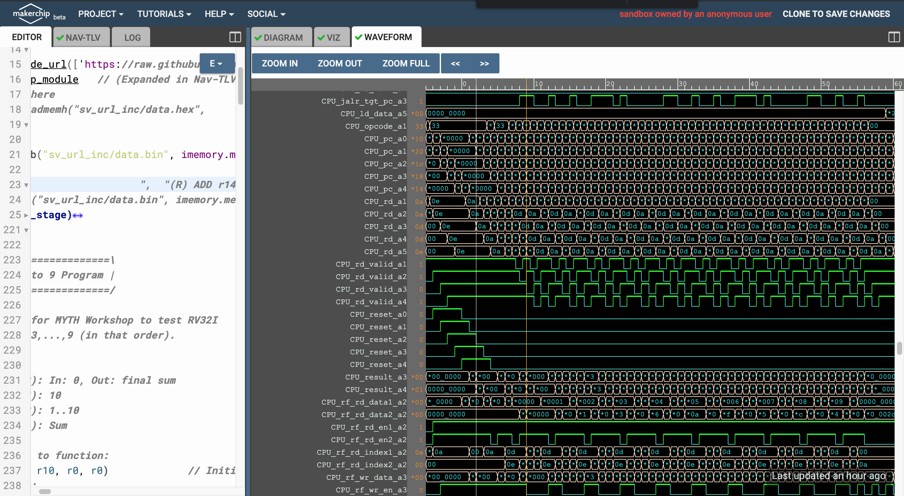

We describe the waveforms last. In these three pictures, we can see some signals: CLK, out, etc.

# OpenLANE

OpenLANE is an automated RTL to GDSII flow based on several components including OpenROAD, Yosys, Magic, Netgen, Fault, SPEF-Extractor and custom methodology scripts for design exploration and optimization. The main usage of OpenLANE in this project is for [VSDMemSoC Physical Design](#vsdmemsoc-physical-design). However, we need OpenLANE for the synthesis and STA process in the [Post-synthesis simulation](#post-synthesis-simulation) section. So we'll talk about its installation process here and let the details be until the [VSDMemSoC Physical Design](#vsdmemsoc-physical-design) section.

## OpenLANE installation

The OpenLANE and sky130 installation can be done by following the steps in this repository `https://github.com/nickson-jose/openlane_build_script`.

* More information on OpenLANE can be found in the following repositories:

  * `https://github.com/The-OpenROAD-Project/OpenLane`
  * `https://github.com/efabless/openlane`

To summarize the installation processes:

  ```
  $ git clone https://github.com/The-OpenROAD-Project/OpenLane.git
  $ cd OpenLane/
  $ make openlane
  $ make pdk
  $ make test
  ```

For more info please refer to the GitHub repositories.

**NOTE** Do not use sudo with any of the commands. Iur docker image version is `2021.09.09_03.00.48`.

# Post-synthesis simulation

First step in the design flow is to synthesize the generated RTL code and after that we will simulate the result. This way we can find more about our code and its bugs. So in this section we are going to synthesize our code then do a post-synthesis simulation to look for any issues. The post and pre (modeling section) synthesis results should be identical.

## Synthesizing using Yosys

* In OpenLANE the RTL synthesis is performed by `yosys`.
* The technology mapping is performed by `abc`.
* Finally, the timing reports for the synthesized netlist are generated by `OpenSTA`.

## How to synthesize the design

To perform the synthesis process do the following:

  ```
  $ cd ~/VSDMemSoC
  $ make synth
  ```

The heavy job will be done by the script. When the process has been done, we can see the result in the `output/synth/vsdmemsoc.synth.v` file.


## Yosys final report

  ```
  === vsdmemsoc ===

   Number of wires:              10055
   Number of wire bits:          12235
   Number of public wires:       10055
   Number of public wire bits:   12235
   Number of memories:               0
   Number of memory bits:            0
   Number of processes:              0
   Number of cells:              12161
     sky130_fd_sc_hd__a2111oi_0     50
     sky130_fd_sc_hd__a211o_2        1
     sky130_fd_sc_hd__a211oi_1      44
     sky130_fd_sc_hd__a21boi_0       9
     sky130_fd_sc_hd__a21o_2         9
     sky130_fd_sc_hd__a21oi_1     1020
     sky130_fd_sc_hd__a221o_2       19
     sky130_fd_sc_hd__a221oi_1     282
     sky130_fd_sc_hd__a22o_2        49
     sky130_fd_sc_hd__a22oi_1      557
     sky130_fd_sc_hd__a2bb2oi_1      1
     sky130_fd_sc_hd__a311oi_1       3
     sky130_fd_sc_hd__a31o_2         4
     sky130_fd_sc_hd__a31oi_1      972
     sky130_fd_sc_hd__a32o_1         1
     sky130_fd_sc_hd__a32oi_1        3
     sky130_fd_sc_hd__and2_2        24
     sky130_fd_sc_hd__clkinv_1    1132
     sky130_fd_sc_hd__dfxtp_1     2062
     sky130_fd_sc_hd__lpflow_inputiso0p_1      1
     sky130_fd_sc_hd__maj3_1         1
     sky130_fd_sc_hd__mux2i_1       10
     sky130_fd_sc_hd__nand2_1     1479
     sky130_fd_sc_hd__nand3_1      536
     sky130_fd_sc_hd__nand3b_1       6
     sky130_fd_sc_hd__nand4_1      228
     sky130_fd_sc_hd__nor2_1      1025
     sky130_fd_sc_hd__nor3_1       103
     sky130_fd_sc_hd__nor3b_1        8
     sky130_fd_sc_hd__nor4_1        61
     sky130_fd_sc_hd__o2111a_1       4
     sky130_fd_sc_hd__o2111ai_1     12
     sky130_fd_sc_hd__o211a_1        2
     sky130_fd_sc_hd__o211ai_1      93
     sky130_fd_sc_hd__o21a_1        22
     sky130_fd_sc_hd__o21ai_0     1874
     sky130_fd_sc_hd__o21bai_1      21
     sky130_fd_sc_hd__o221ai_1      33
     sky130_fd_sc_hd__o22ai_1      260
     sky130_fd_sc_hd__o2bb2ai_1      2
     sky130_fd_sc_hd__o311ai_0       8
     sky130_fd_sc_hd__o31a_2         2
     sky130_fd_sc_hd__o31ai_1       27
     sky130_fd_sc_hd__o32ai_1        2
     sky130_fd_sc_hd__o41ai_1        4
     sky130_fd_sc_hd__or2_2         21
     sky130_fd_sc_hd__or4_2          1
     sky130_fd_sc_hd__xnor2_1       16
     sky130_fd_sc_hd__xor2_1        56
     sram_32_1024_sky130A            1

  ```

# VSDMemSoC Physical Design

In integrated circuit design, physical design is a step in the standard design cycle which follows after the circuit design. At this step, circuit representations of the components (devices and interconnects) of the design are converted into geometric representations of shapes which, when manufactured in the corresponding layers of materials, will ensure the required functioning of the components. This geometric representation is called integrated circuit layout. This step is usually split into several sub-steps, which include both design and verification and validation of the layout.

  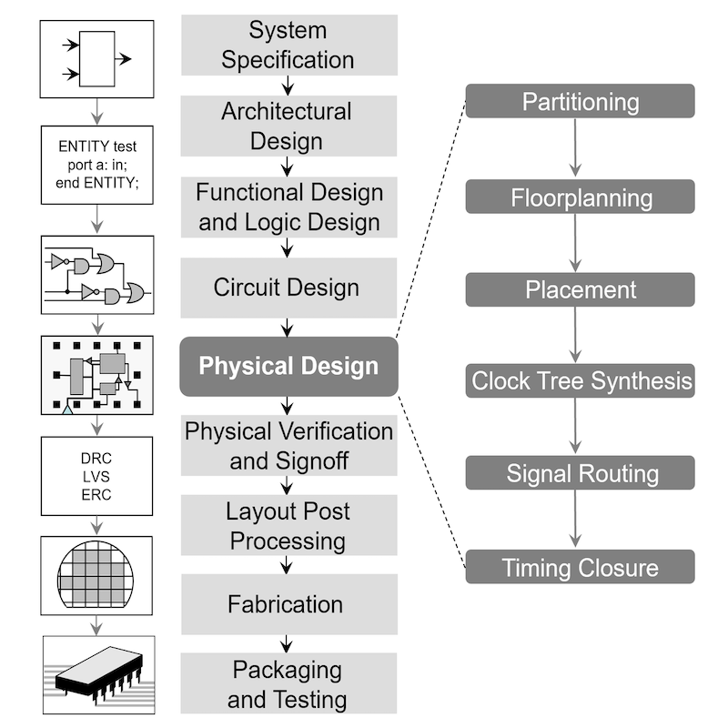

## OpenLANE details and flow

Here is the picture of the OpenLANE architecture:

  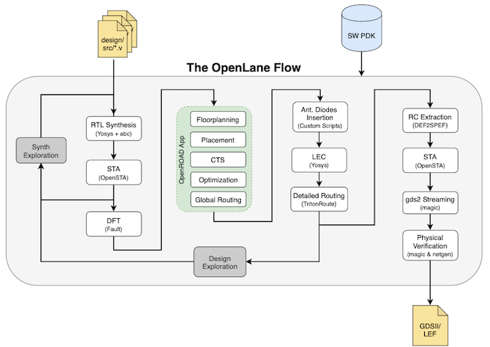

OpenLANE flow consists of several stages. By default all flow steps are run in sequence. Each stage may consist of multiple sub-stages. Lots of info about the flow and its internal tools can be found [Here](https://github.com/The-OpenROAD-Project/OpenLane/blob/master/README.md).

  * [This](https://github.com/The-OpenROAD-Project/OpenLane/blob/master/docs/source/advanced_readme.md) link contains info about how to run OpenLANE in `interactive` mode.
  * [This](https://github.com/The-OpenROAD-Project/OpenLane/blob/master/configuration/README.md) link contains info about different variables for configuration.
  * [This](https://github.com/The-OpenROAD-Project/OpenLane/blob/master/docs/source/hardening_macros.md) link contains info about building hard macros using OpenLANE.

We'll leverage info of these links during the project to build the VSDBabySoC layout.

## Other required tools

Although OpenLANE integrates all required tools in its flow, sometimes we need to use a toolset direcltly from our host OS/Ubuntu. As an example it is not possible to open GUI of the `Magic VLSI Layout` software from the OpenLANE docker container due to container command line nature. So we need to install the tool on our main OS/Ubuntu and open it from there (not the container).

### Magic

[Magic](https://github.com/RTimothyEdwards/magic) is a venerable VLSI layout tool, written in the 1980's at Berkeley by John Ousterhout, now famous primarily for writing the scripting interpreter language Tcl. Due largely in part to its liberal Berkeley open-source license, magic has remained popular with universities and small companies. The open-source license has allowed VLSI engineers with a bent toward programming to implement clever ideas and help magic stay abreast of fabrication technology. However, it is the well thought-out core algorithms which lend to magic the greatest part of its popularity. Magic is widely cited as being the easiest tool to use for circuit layout, even for people who ultimately rely on commercial tools for their product design flow. [Here](https://github.com/RTimothyEdwards/magic/blob/master/INSTALL) is how to install it on a machine.

## RVMYTH RTL2GDSII flow

Here we are going to implement a fully digital design using OpenLANE. This way we can get our hands dirty and learn a lot about the OpenLANE flow. Implementing mixed-signal layout without gathering knowledge of this step is pretty much tough.

### RVMYTH layout generation setting up the environment

We are using `OPENLANE_PATH` environment variable to reference the OpenLANE installed directory. As an example imagine we have installed the OpenLANE in the `~/OpenLane` directory, so the value of the `OPENLANE_PATH` variable would be `~/OpenLane`. This value should be changed in the [Makefile](Makefile#L6) before any progress.

### RVMYTH layout generation flow configuration

We have provided minimum required configurations in [this](src/layout_conf/rvmyth/config.tcl) file. However, the file could be changed accorting to other requirements. This file will be copied directly to the OpenLANE `designs/rvmyth` folder for layout implementation.

### RVMYTH layout generation flow running

The RVMYTH layout generation flow could be all started by the following command.

  ```
  $make rvmyth_layout
  ```

[The script](Makefile#L75) will take care of the rest of the process. The process should take about 20mins depending on the PC/laptop hardware configurations. After that results can be found in the `output/rvmyth_layout` folder.

### RVMYTH post-routing simulation

The following command will produce a file named `post_routing_sim.vcd` which can be used to simulate post-routing and powered model.

  ```
  $make rvmyth_post_routing_sim
  $gtkwave out/rvmyth_layout/post_routing_sim.vcd
  ```

Here is the result.

  

As it can be seen the result is exactly the same as the previous results.

### RVMYTH post-routing STA

In this step we are going to do STA on the RVMYTH design. First we should create a timing database that we will query for STA. Follow the instructions:

  ```
  $make mount
  $./flow.tcl -design rvmyth -tag rvmyth_test -interactive | tee /VSDMemSoC/output/rvmyth_layout/sta.log
  %openroad
  %read_lef designs/rvmyth/runs/rvmyth_test/tmp/merged.lef
  %read_def designs/rvmyth/runs/rvmyth_test/results/cts/rvmyth.cts.def
  %write_db designs/rvmyth/runs/rvmyth_test/rvmyth.db
  ```

Now we can query the database and excract the STA out of it by the following commands (**NOTE** that we are still in **OpenROAD** environment o/w we should re-enter the environment):

  ```
  %read_db designs/rvmyth/runs/rvmyth_test/rvmyth.db
  %read_verilog designs/rvmyth/runs/rvmyth_test/results/lvs/rvmyth.lvs.powered.v
  %read_liberty $::env(LIB_SYNTH_COMPLETE)
  %link_design rvmyth
  %read_sdc scripts/base.sdc
  %set_propagated_clock [all_clocks]
  %report_checks -path_delay min_max -format full_clock_expanded -digits 4
  %exit
  %exit
  $exit
  ```

Here is the `min_max` analysis result:

  ```
  Startpoint: _09644_ (rising edge-triggered flip-flop clocked by CLK)
  Endpoint: _09612_ (rising edge-triggered flip-flop clocked by CLK)
  Path Group: CLK
  Path Type: min

      Delay      Time   Description
  -------------------------------------------------------------
     0.0000    0.0000   clock CLK (rise edge)
     0.0000    0.0000   clock source latency
     0.0100    0.0100 ^ CLK (in)
     0.1302    0.1402 ^ clkbuf_0_CLK/X (sky130_fd_sc_hd__clkbuf_16)
     0.2797    0.4199 ^ clkbuf_4_7_0_CLK/X (sky130_fd_sc_hd__clkbuf_1)
     0.2127    0.6326 ^ clkbuf_leaf_21_CLK/X (sky130_fd_sc_hd__clkbuf_16)
     0.0000    0.6326 ^ _09644_/CLK (sky130_fd_sc_hd__dfxtp_1)
     0.3158    0.9484 v _09644_/Q (sky130_fd_sc_hd__dfxtp_1)
     0.0000    0.9484 v _09612_/D (sky130_fd_sc_hd__dfxtp_2)
               0.9484   data arrival time

     0.0000    0.0000   clock CLK (rise edge)
     0.0000    0.0000   clock source latency
     0.0100    0.0100 ^ CLK (in)
     0.1302    0.1402 ^ clkbuf_0_CLK/X (sky130_fd_sc_hd__clkbuf_16)
     0.4999    0.6401 ^ clkbuf_4_12_0_CLK/X (sky130_fd_sc_hd__clkbuf_1)
     0.2775    0.9176 ^ clkbuf_leaf_42_CLK/X (sky130_fd_sc_hd__clkbuf_16)
     0.0000    0.9176 ^ _09612_/CLK (sky130_fd_sc_hd__dfxtp_2)
     0.0000    0.9176   clock reconvergence pessimism
    -0.0434    0.8741   library hold time
               0.8741   data required time
  -------------------------------------------------------------
               0.8741   data required time
              -0.9484   data arrival time
  -------------------------------------------------------------
               0.0743   slack (MET)


  Startpoint: _09572_ (rising edge-triggered flip-flop clocked by CLK)
  Endpoint: OUT[5] (output port clocked by CLK)
  Path Group: CLK
  Path Type: max

      Delay      Time   Description
  -------------------------------------------------------------
     0.0000    0.0000   clock CLK (rise edge)
     0.0000    0.0000   clock source latency
     0.0100    0.0100 ^ CLK (in)
     0.1302    0.1402 ^ clkbuf_0_CLK/X (sky130_fd_sc_hd__clkbuf_16)
     0.6871    0.8273 ^ clkbuf_4_8_0_CLK/X (sky130_fd_sc_hd__clkbuf_1)
     0.2944    1.1217 ^ clkbuf_leaf_97_CLK/X (sky130_fd_sc_hd__clkbuf_16)
     0.0000    1.1217 ^ _09572_/CLK (sky130_fd_sc_hd__dfxtp_1)
     0.3045    1.4261 ^ _09572_/Q (sky130_fd_sc_hd__dfxtp_1)
     0.1444    1.5706 ^ output7/X (sky130_fd_sc_hd__clkbuf_2)
     0.0000    1.5706 ^ OUT[5] (out)
               1.5706   data arrival time

    20.0000   20.0000   clock CLK (rise edge)
     0.0000   20.0000   clock network delay (propagated)
     0.0000   20.0000   clock reconvergence pessimism
    -4.0000   16.0000   output external delay
              16.0000   data required time
  -------------------------------------------------------------
              16.0000   data required time
              -1.5706   data arrival time
  -------------------------------------------------------------
              14.4294   slack (MET)
  ```

The report can be found in `output/rvmyth_layout/sta.log` file.

### RVMYTH final GDSII layout

To see the final GDSII layout, we must first change directory to `output/rvmyth_layout/rvmyth_test/results/magic` (because we need to access `.magicrc` file) and then open the `rvmyth.gds` file by `magic` software. So here it is:

  ```
  $cd ~/VSDMemSoC
  $cd output/rvmyth_layout/rvmyth_test/results/magic
  $magic rvmyth.gds
  ```
Now here is the final result of the RVMYTH GDSII layout.

  

## VSDMemSoC-a mixed-signal RTL2GDSII flow

As we know VSDBabySoC is a small mixed-signal SoC that contains a PLL, a DAC, and a RISCV-based processor named RVMYTH. All of these IP cores -from digital to analog- brought to us by **VLSI-System-Design (VSD)** students which shows a greate potential in the community. Two main contributions of this work are:

  1. Building the SoC all around the student wroks.
  2. Automating mixed-signal physical design flow by open-source tools (i.e. OpenLANE).

In this section we are going to talk about how to implement our design, in detail.

### Prerequisites for mixed-signal implementation

To start physical design process of a mixed-signal chip by the OpenLANE flow we need to provide three files per each analog IP. OpenLANE will use these informations to create final GDSII layout. Here they are:

#### LIB file and its usage

The .lib file is an ASCII representation of the timing and power parameters associated with any cell in a particular semiconductor technology
The timing and power parameters are obtained by simulating the cells under a variety of conditions and the data is represented in the .lib format
The .lib file contains timing models and data to calculate

  * I/O delay paths
  * Timing check values 
  * Interconnect delays

I/O path delays and timing check values are computed on a per-instance basis. [Reference](https://www.csee.umbc.edu/courses/graduate/CMPE641/Fall08/cpatel2/slides/lect05_LIB.pdf)

In mixed-signal design, we instantiate the analog IP cores (e.g. PLL and DAC) as a black-box, and the synthesizer and STA tool will use .lib info to do their tasks. Unfortunately, there is no free open-source tools to extract the timing and power info from the final spice model. So we'll use a fake .lib file for our IP cores that will be generated by a perl script.

#### GDS file and its usage

GDSII stream format, common acronym GDSII (or GDS), is a database file format which is the de facto industry standard for data exchange of integrated circuit or IC layout artwork. It is a binary file format representing planar geometric shapes, text labels, and other information about the layout in hierarchical form. The data can be used to reconstruct all or part of the artwork to be used in sharing layouts, transferring artwork between different tools, or creating photomasks. [Reference](https://en.wikipedia.org/wiki/GDSII)
In this project we'll need GDS file for two main reasons:

  1. To extract the LEF file out of it (we'll cover the LEF file usage in the next topic.)
  2. To create final full GDS layout

#### LEF file and its usage

For a PnR tool to correctly place and route a block (a macro or a std. cell), it doesn't need to know entire layout information of the block; just the pin positions, PR boundary is sufficient. These minimal and abstracted information is provided to the tool by the Library Exchange Format (LEF) file. LEF file also serves the purpose of protecting intellectual property and is basically of two types:
- Cell LEF - It's an abstract view of the cell and only gives information about PR boundary, pin position and metal layer information of the cell.
- Technology LEF - It contains information about available metal layer, via information, DRCs of particular technology used by placer and router and so on. [Reference](https://github.com/nickson-jose/vsdstdcelldesign/blob/master/README.md#introduction-to-lef)
The below diagram highlights the difference between a layout and a LEF (**Image Courtesy:** Google):

  

# Future works

Currently our design is just synthesis. We aim to solve the layout, timing and routing and whe then have the chip ready for fabrication.

# Contributors

- [Mufutau Akuruyejo](https://github.com/MufuteeVC)

# Acknowledgements

- [Mohammad A. Nili](https://github.com/manili), M.S. Student at SRBIAU
- [Kunal Ghosh](https://github.com/kunalg123), Co-founder, VSD Corp. Pvt. Ltd.
- [Steve Hoover](https://github.com/stevehoover), Founder, Redwood EDA
